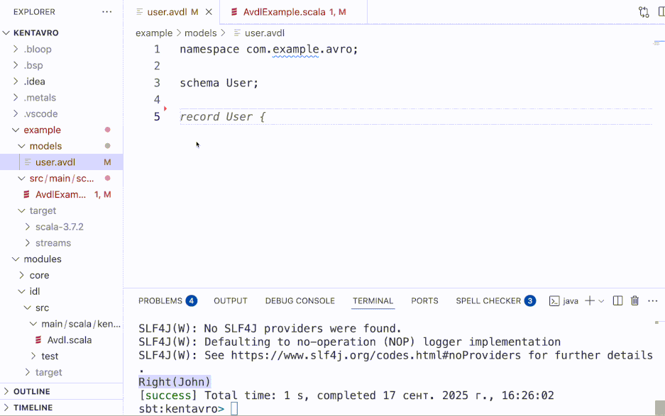

# KentAvro

KentAvro is micro-macro-library for Scala to work with [avro](https://github.com/apache/avro) schemas without code generation.

## Example

## See also

- [jing](https://github.com/TomasMikula/jing)
